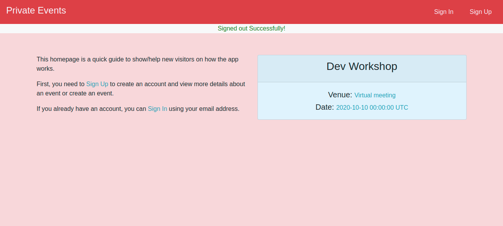

# PRIVATE-EVENTS

## Screenshot

## Live Demo
[Live Demo Link]() 

**Completed the necessary steps in building a private events site similar to Eventbrite, which allows users to create events and then manage user signups using the following criteria: 
- Users can create events and send invitations and parties. 
- Events take place at a specific date and at a location. 
- A user can create events. 
- A user can attend many events. 
- An event can be attended by many users.

## 🔧 Built with

Ruby
Ruby on Rails
Sqlite3
PostgresSQL

## Configurations
- Models,Views and Controllers
- Gem installations
- Validations 
- Relationships
- Migrations

## Extra Ruby gems
- Hirb
- Bootstrap

## Authentication procedure
- Authentication from scratch

## Database configuration:
1. Models
- User
- Event
- Event_attending

2. Validations
- User name, email and password validations for length and uniqueness.
- Event title and description validations

3. Associations
- belongs_to for a one-to-one connection
- has_many for a many-to-many connection among models

4. A Few Gems:
- Using the Gemfile to Set up a RubyGem:
In this iteration we took take advantage of the many plugins and libraries available to quickly add features and error handlers to your application. The bootstrap plugin gem was added and used for styling the UI.

5. Migrations
Migrations were run to:
- Add Fields to users
- Create User model
- Create Event model
- Create Event_attending model
- Add id for event to event_attending model
- Add creator_id to event model
- Add index on event_id in event attending model

## Prerequisites
Ruby, RubyGems, sqlite3, yarn and node

## Getting Started
1. Compulsory Installations:
- Git
- Ruby 2.7.1 or latest version
- RVM
- A few Gems

2. Rails Setup:
Next we need to install dependencies and setup the database.

3. Rails Console:
Check that the console is working properly by running $ rails console in your terminal. 
Run association tests in console to test for model connections.

4. Run bundle install in the terminal to install gems and their dependencies.

5. Run rails db:migrate to update the database.

6. Run rails s or rails server in the terminal to start the server.

## 🔨 Setup 

- To clone the repo to your local repository. Follow this steps
- <code> git clone https://github.com/Rumbie-Mudzie7/private-events.git</code>
- <code> cd private-events</code>

## Authors

👤 **Rumbidzayi Mudziviri**

- Github: [@Rumbie-Mudzie7](https://github.com/Rumbie-Mudzie7)
- Twitter: [@RumbidzayiMudz3](https://twitter.com/RumbidzayiMudz3)
- Linkedin: [rumbidzayimudziviri](https://www.linkedin.com/in/rumbidzayi-mudziviri)
- rumbiemudzie@gmail.com

👤 **Clayton Siby**
- Github: [@Clayton Siby](https://github.com/ClaytonSiby)
- Twitter: [@ClaytonSiby](https://twitter.com/ClaytonSiby)
- Linkedin: [linkedin](https://www.linkedin.com/in/clayton-siby/)
- claytonsiby@gmail.com

## 🤝 Contributing

Contributions, issues and feature requests are welcome!

Feel free to check the fork this repo and create pull request if you want to make changes.

## 👍 Show your support

Give a ⭐️ if you like this project!

## :thumbsup: Acknowledgements
The Odin project Guide:
https://www.theodinproject.com/courses/ruby-on-rails/lessons/